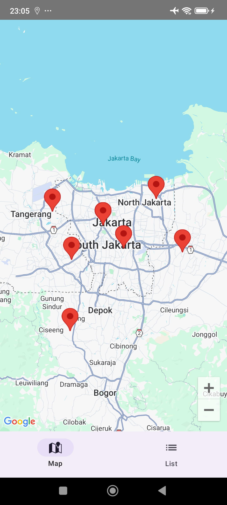
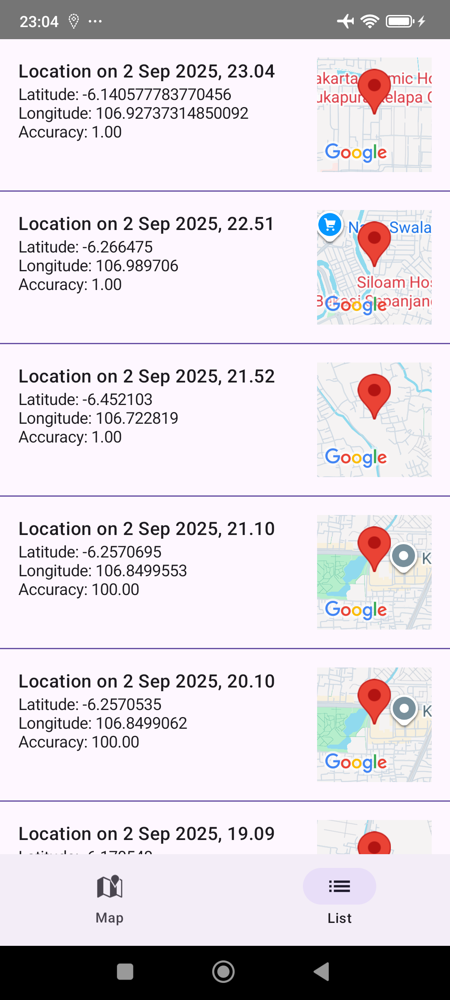

# 📍 Location Tracker Android App
An Android app that continuously collects and stores GPS pings — even when the app is killed — and visualizes them on a map and in a list view.  
The app is built with **Kotlin**, **Jetpack Compose**, **Hilt (KSP)**, **Room**, **WorkManager**, and **Google Maps Compose**.

---

## ✨ Features
- ✅ Collects GPS pings in the background (at least 1 per hour)  
- ✅ Works even if the app is **killed** (not just backgrounded)  
- ✅ Shows pins on a **Google Map** with `maps-compose`  
- ✅ Displays a **list view** of collected pings (time & coordinates) 
- ✅ Uses **Room database** to persist location history
- ✅ Hilt integration with WorkManager  
- ✅ API key is stored securely in `local.properties`  

---

## 📱 Screenshots
Google Maps | List
--- | ---
 | 
---

## ⚙️ Tech Stack
- **Language**: Kotlin  
- **UI**: Jetpack Compose + Material 3  
- **Navigation**: Navigation Compose  
- **Dependency Injection**: Hilt + KSP  
- **Persistence**: Room (KSP)  
- **Background Work**: WorkManager + HiltWorkerFactory  
- **Location Services**: FusedLocationProviderClient (Play Services)  
- **Maps**: Google Maps Compose  

---

## 🚀 Getting Started
### 1. Clone the repo
```bash
git clone https://github.com/chaterinanf/Location-Tracker.git
cd location-tracker
```
### 2. Add API Key
In your project’s `local.properties`, add your Google Maps API key:
```
MAPS_API_KEY=YOUR_API_KEY_HERE
```
This key will be injected automatically into `AndroidManifest.xml` (via `manifestPlaceholders`)
### 3. Run the app
Open the project in **Android Studio (Ladybug or newer)** and hit **Run** ▶️.

---

## ⚠️ Known Limitations
- Background tracking depends on system restrictions (e.g., OEM battery optimizations).
- Some devices may aggressively kill background workers.
- You must select *Allow all the time* for location access on Android 10+.

---

## 🤝 Contributing
PRs are welcome! Please open an issue first to discuss any major changes.
